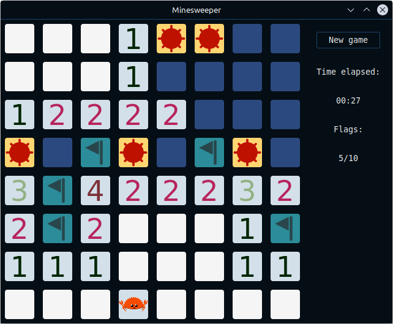

# rust-minesweeper

Minesweeper game written with Gtk-rs. This was my project for the Rust programming course at uni. I also made the icons for the game on Inkscape.

The game has the same rules as the original minesweeper but with a twist...

